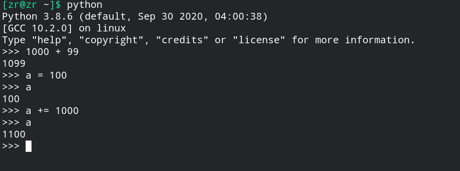
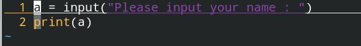
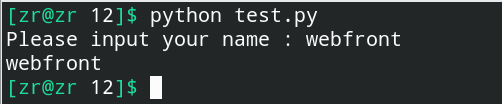

# Python解释器的使用方式

## 一、交互模式(interactive mode)

进入交互模式的方法：

+ Windows：在cmd或者powershell等中键入python后回车，即可进入交互模式。
+ Linux/Unix(BSD, Mac OS and so on)：在terminal中键入python后回车，即可进入交互模式。

交互模式体现了Python作为解释型语言的特点：**对语句逐条解释**。

下面是Linux使用Python交互模式的截图：

> 实际上我经常拿Python的交互模式当计算器用，有时也会用来验证一些结论或功能。

## 二、执行Python源代码文件

使用Python解释器执行Python源代码文件：

+ Windows：在cmd、powershell中键入`python 文件名`命令即可执行相应的Python文件。
+ Linux/Unix：在终端中键入`python 文件名`命令即可执行响应的Python文件。

 例如，Python文件源代码文件text.py的内容：

用python命令调用Python解释器执行Python源代码文件：

