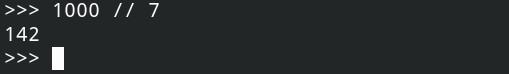

# 数字与基本数学运算

## 一、数字类型

Python支持的数字类型：

+ 整型(int类型，数学意义上的整数，即整数集合$Z$中的数字)
+ 浮点型(float类型，即带小数部分的数字，如$1.12、-100.093$等等，由于计算机中小数部分的位数是有长度限制，Python中小数部分最长不超过10位)。


>  根据这个例子可以发现，Python的浮点运算(实际上是所有语言的浮点数计算)会有精度损失。

+ 复数：一般用不到。


## 二、基本数学运算

### 1.加减乘除四则运算

+，-，*, / 这四个运算符分别对应加、减、乘、除运算：


除法运算符号`/`，Python总是返回浮点类型，如果是整数之间的除法，并且结果需要为整数(下取整)，使用`//`下取整除法运算符即可，如下图所示：



### 2.取模运算(整数的运算)

取模运算符为%，如整数$a$对整数$b$取模，实际上获得的是a除以b之后的余数。


### 3.幂次运算

如果需要计算如"2的100次方"，" 5.5的9次方"等等幂次计算，python内置了`** `运算符：

```python
# 交互模式下：
# 2 的 100 次方
2 ** 100
# 5.5 的 9 次方
5.5 ** 9
```

交互模式下的运行截图：

 

> 还有一些基本运算，考虑到一些部分大一的学生，就不讲了，大二的可以参照C语言支持的几种数学运算上网查查。


## 三、标准数学库`math` (模块)

Python有标准数学库`math`，这是用来专门做一些上学运算的，要使用`math`库，需要引`入math`模块：

```python
import math
```

简要介绍一些标准数学库math中常用的一些简单方法：

+ `ceil()`：向上取整
+ `floor()` ：向下取整
+ ` fabs()`：计算绝对值

此外，math库中还有计算三角函数，双曲函数等的方法，不过这些都是最基本的，积分等运算在第三方库中。

