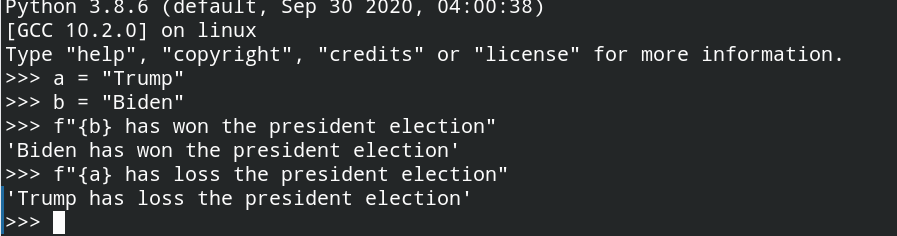

# 格式化字符串

Python的格式化字符串有如下三种：

+ 使用格式化字符串字面值(**最新，使用也最方便**)
+ 使用字符串的`str.format()`方法
+ 采用C风格的格式化字符串

格式化字符串一般会在代码调试或者输出日志信息时使用，平时做题也会涉及部分格式化字符串的内容。

为了加快速度，这里只介绍格式化字符串字面值的方法。

## 一、格式化字符串字面值

格式化字符串字面值（常简称为 f-字符串）能让你在字符串前加上 `f` 和 `F` 并将表达式写成 `{expression}` 来在字符串中包含 Python 表达式的值。

例子如下：



这实际上就是将表达式的值填充到f-字符串中对应的`{}`位置。

**可选的格式说明符**可以跟在表达式后面。这样可以更好地控制值的格式化方式。

平时做题会遇到**保留小数点后几位**的题目，例如将`10 / 3`的结果保留小数点后4位：

```python
>>> f"{10 / 3:.4f}"
'3.3333'
```

之前我布置的作业中有题目要求固定输出9列(**列对齐**)，那么可以**在 `':'` 后传递一个整数可以让该字段成为最小字符宽度。**

```python
>>> f"{100 ** 2:9}" # 默认右对齐
'    10000'
>>> f"{100 ** 2:<9}" # ：后加上<，就是左对齐
'10000    '
```

