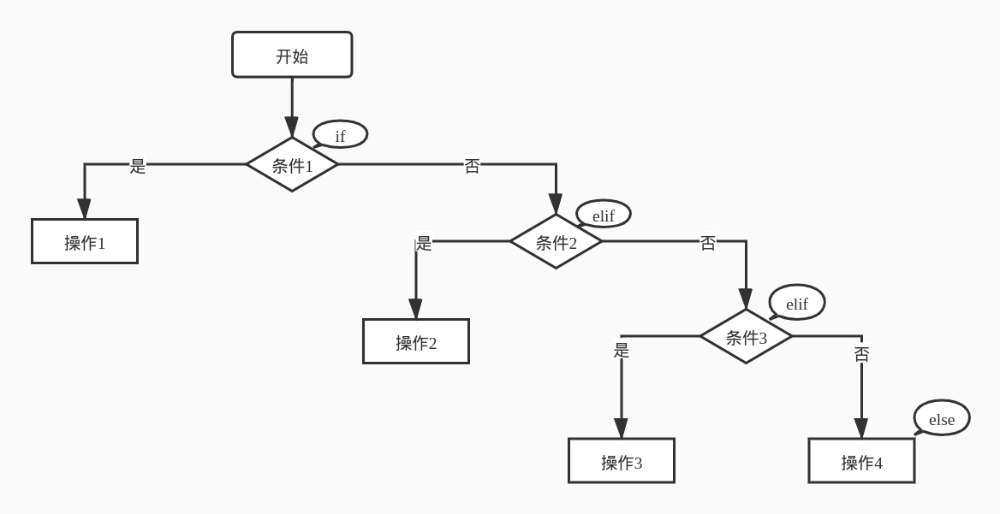

# if 条件分支语句

## 一、if条件分支语句

if条件分支语句通常的结构：`if-elif-else`。

可以有0个或多个`elif`部分，以及一个可选的`else`部分。

> `elif`是`else if`的缩写。

下图是一张简易的`if-elif-else`语句的流程图：



通过一个例子来讲解if分支语句：

输入一个整数，如果是负数，则输出“negative number”，如果在0到100之间(包括0和100)，则输出"non-negative number not larger than 100"，否则输出"number larger than 100"。

```python
x = int(input("Please input a interger : "))
if x < 0:
    print("negative number")
elif x <= 100:
    print("non-negative number not larger than 100")
else:
    print("number larger than 100")
```


## 二、Python的缩进规则

在Python中，对于流程控制语句`if-elif-else`,`for`,`while`，函数定义，类定义，异常处理语句等，行尾的冒号和下一行的缩进(4个空格，或者按一下Tab键)，表示下一个代码块的开始，而缩进的结束则代表此代码块的结束。