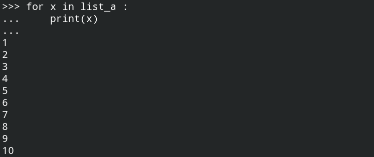
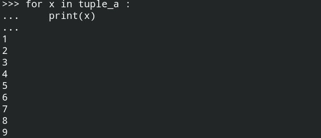
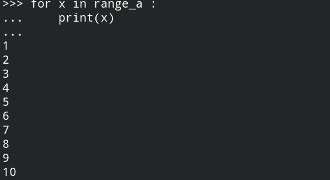
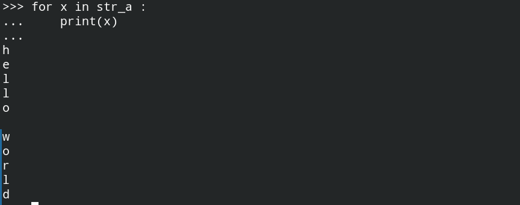
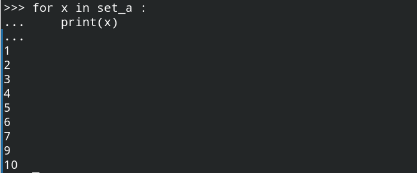
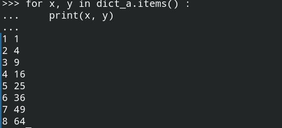
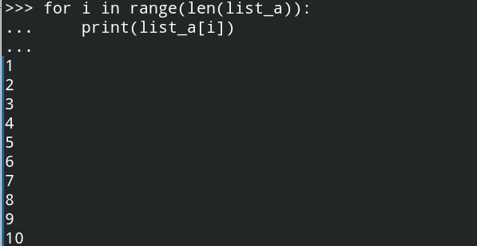

# for循环语句

Python的for循环是`for each`类型的for循环，即“对需要遍历的数据集中的每一个数据，执行某操作”，但是也可以配合range来按照下标来模仿C风格的for循环。

##  一、`for-each`型循环

以list, tuple, range, str, set, dict的`for-each`类型循环作为例子：

```python
>>> list_a = [1, 2, 3, 4, 5, 6, 7, 8, 9, 10]
>>> tuple_a = (1, 2, 3, 4, 5, 6, 7, 8, 9)
>>> range_a = range(1, 11, 1)
>>> str_a = "hello world"
>>> set_a = {1, 2, 3, 4, 5, 6, 7, 9, 9, 10}
>>> dict_a = {1 : 1, 2 : 4, 3 : 9, 4 : 16, 5 : 25, 6 : 36, 7 : 49, 8 : 64}
```

list的`for-each`类型循环：



tuple的`for-each`类型循环：



range的`for-each`类型循环：



str的`for-each`类型循环：



set类型的`for-each`类型循环：



dict类型的`for-each`类型的循环：

字典的`for-each`循环是对`dict.keys(), dict.values(), dict.items()`进行的，这里以对`dict.items()`的为例：



**从上面这些例子可以看出，for-each类型的循环实际上就是对这些数据结构中的元素进行遍历处理，使用`for-each`类型循环的优点就是不用担心越界，但是缺点就是对序列类型的数据类型无法按照下标访问元素，因此，可以使用range()来实现通过下标访问的for循环，这样一般也不会越界。**


## 二、使用range()的for循环

使用range()的for循环目的就是可以通过下标访问序列类型数据中的元素，以对list的遍历为例。

